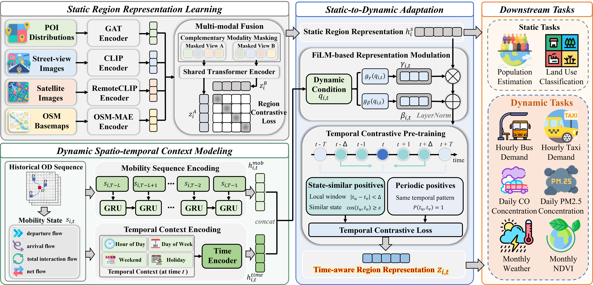

# UrbanDyad: Urban Static-to-Dynamic Adaptation for Time-Aware Region Representation Learning

This is the official implementation of **UrbanDyad**.

UrbanDyad is a framework for time-aware urban region representation learning. It first
learns a reusable multi-modal static semantic foundation from urban observations, and
then adapts this static representation into region-time embeddings using OD-derived
mobility states and temporal context.

The framework consists of three components:

1. **Static representation learning** (`src/static_encoder/`): multi-modal static
   semantic encoding with POI, street-view, remote sensing, and OSM basemap features.
2. **Dynamic adaptation** (`src/dynamic_adapter/`): mobility-time conditioning and
   FiLM-based static-to-dynamic adaptation.
3. **Downstream evaluation** (`src/downstream/`): MLP-based predictors for static and
   dynamic urban sensing tasks.



## Project Structure

```text
UrbanDyad/
├── README.md
├── requirements.txt
├── scripts/
│   ├── pretrain_static.py
│   ├── pretrain_dynamic.py
│   ├── pretrain_dynamic_daily.py
│   ├── pretrain_dynamic_monthly.py
│   ├── export_static_embeddings.py
│   ├── export_dynamic_embeddings.py
│   ├── predict_population.py
│   ├── predict_land_use.py
│   ├── predict_bus_demand.py
│   ├── predict_taxi_demand.py
│   ├── predict_co.py
│   ├── predict_pm25.py
│   ├── predict_ndvi.py
│   └── predict_meteorology.py
└── src/
    ├── static_encoder/
    │   ├── train.py
    │   ├── models.py
    │   ├── data.py
    │   ├── losses.py
    │   ├── graph_utils.py
    │   ├── build_poi_graph.py
    │   └── export_embeddings.py
    ├── dynamic_adapter/
    │   ├── train.py
    │   ├── train_daily.py
    │   ├── train_monthly.py
    │   ├── models.py
    │   ├── data.py
    │   ├── losses.py
    │   └── export_embeddings.py
    └── downstream/
        ├── static_population_landuse_prediction.py
        ├── hourly_demand_prediction.py
        ├── daily_pollution_prediction.py
        └── monthly_environment_prediction.py
```

## Installation

```bash
conda create -n urbandyad python=3.10
conda activate urbandyad
pip install -r requirements.txt
```

The implementation uses PyTorch. If the POI graph encoder is enabled, install
PyTorch Geometric following the official instructions for your local PyTorch and CUDA
versions.

## Data Availability

The full raw datasets used in the paper are not included in this repository because
some sources are subject to license or access restrictions, including China Unicom OD
records, Baidu street-view images, and Amap POI records. Model checkpoints and learned
embeddings are also not uploaded.

Users with access to equivalent data can reproduce the pipeline by preparing processed
files with the following schemas:

```text
poi_by_cell.csv
cell_id,category_1,category_2,...,category_23

od_records.csv
origin_cell_id,destination_cell_id,timestamp,flow

mobility_state_by_cell.csv
cell_id,timestamp,departure,arrival,total_interaction,net_flow

static_embeddings.csv
cell_id,emb_0,emb_1,...,emb_127

dynamic_embeddings.csv
cell_id,timestamp,emb_0,emb_1,...,emb_127

downstream_labels.csv
cell_id,timestamp,task_name,label
```

Public downstream data should be obtained from the official sources cited in the
paper. Restricted data should be converted to the above formats before running the
training or evaluation scripts.

## Usage

### Static Representation Learning

```bash
python scripts/pretrain_static.py
```

Export static region embeddings:

```bash
python scripts/export_static_embeddings.py
```

### Dynamic Adaptation

Hourly dynamic adaptation:

```bash
python scripts/pretrain_dynamic.py
```

Daily dynamic adaptation:

```bash
python scripts/pretrain_dynamic_daily.py
```

Monthly dynamic adaptation:

```bash
python scripts/pretrain_dynamic_monthly.py
```

Export dynamic region-time embeddings:

```bash
python scripts/export_dynamic_embeddings.py
```

### Downstream Evaluation

Static downstream tasks:

```bash
python scripts/predict_population.py --features path/to/static_embeddings.npy --labels path/to/population_labels.npy --output-root outputs --run-name population
python scripts/predict_land_use.py --features path/to/static_embeddings.npy --labels path/to/land_use_labels.npy --output-root outputs --run-name land_use
```

Dynamic downstream tasks:

```bash
python scripts/predict_bus_demand.py --input-csv path/to/hourly_bus_samples.csv
python scripts/predict_taxi_demand.py --input-csv path/to/hourly_taxi_samples.csv
python scripts/predict_co.py --input-csv path/to/daily_co_samples.csv
python scripts/predict_pm25.py --input-csv path/to/daily_pm25_samples.csv
python scripts/predict_ndvi.py --input-csv path/to/monthly_ndvi_samples.csv
python scripts/predict_meteorology.py --input-csv path/to/monthly_meteorology_samples.csv
```

## Reproducibility Notes

This repository is intended to document and release the computational pipeline of
UrbanDyad. Since raw data and trained weights are not redistributed, exact reproduction
requires access to the corresponding urban datasets or compatible alternatives.

Before running the scripts, users should update input paths, output paths, and hardware
settings according to their local environment.

## Citation

If you use this repository, please cite the UrbanDyad paper after publication.
